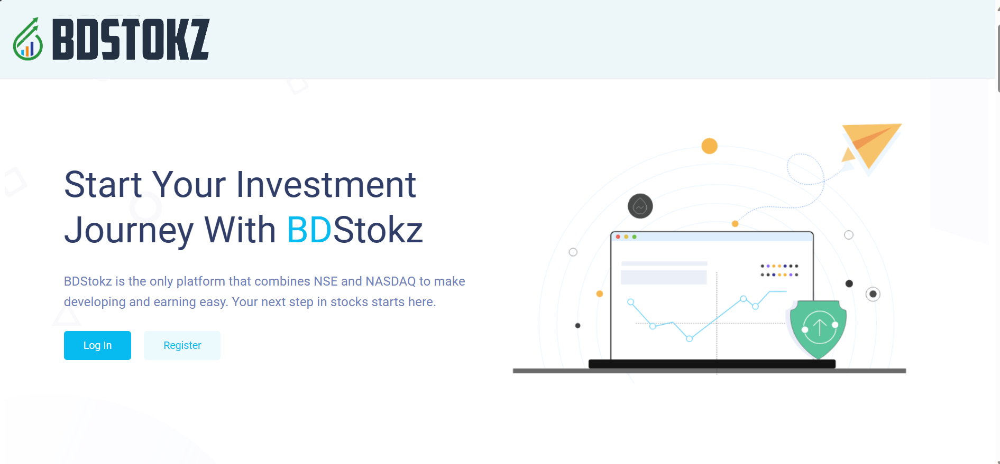
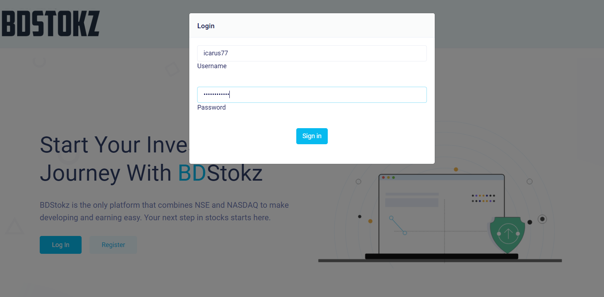
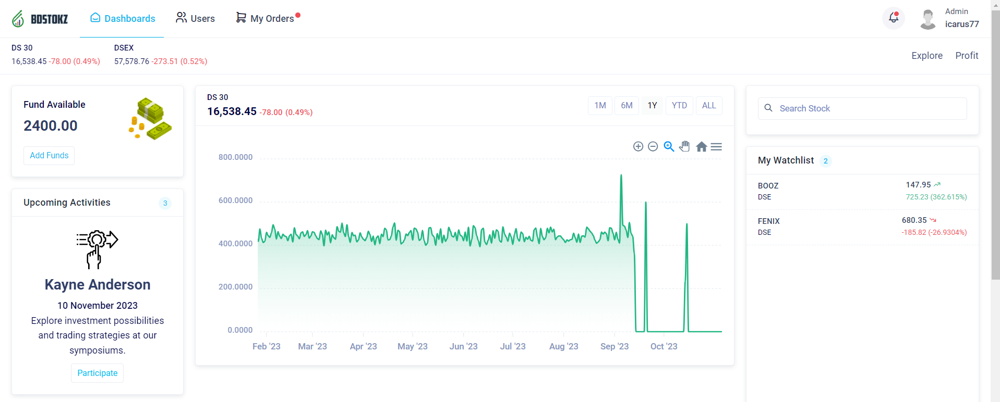
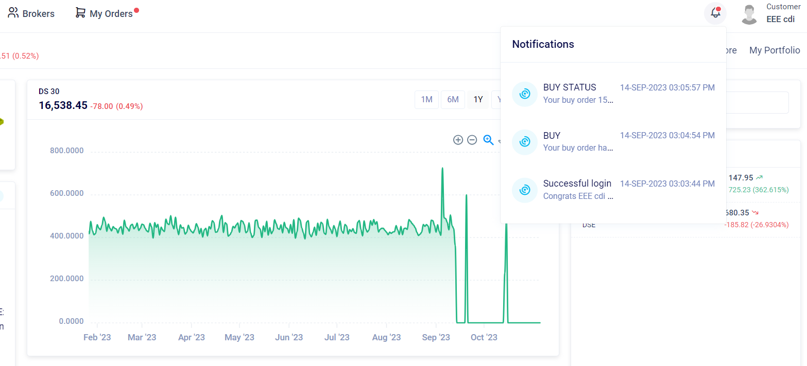
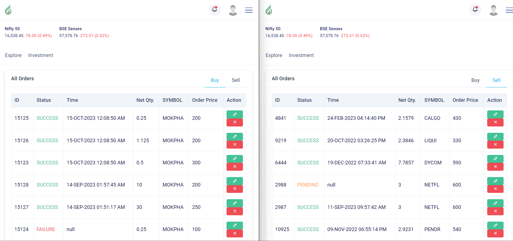
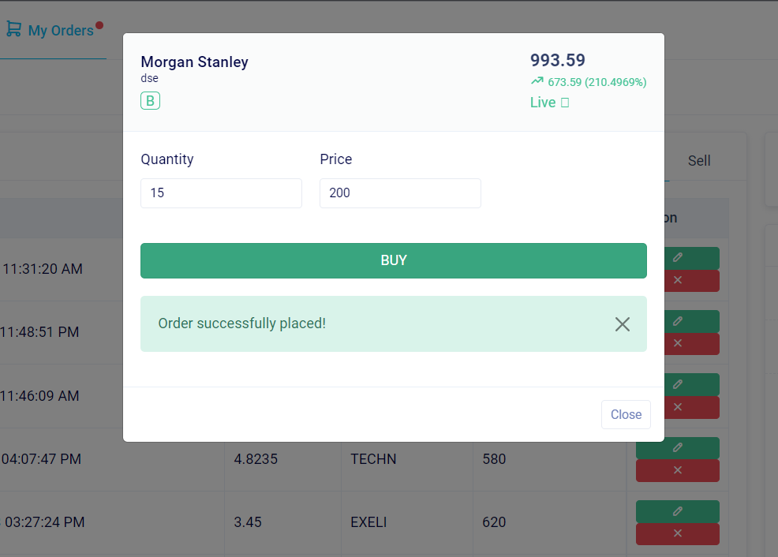
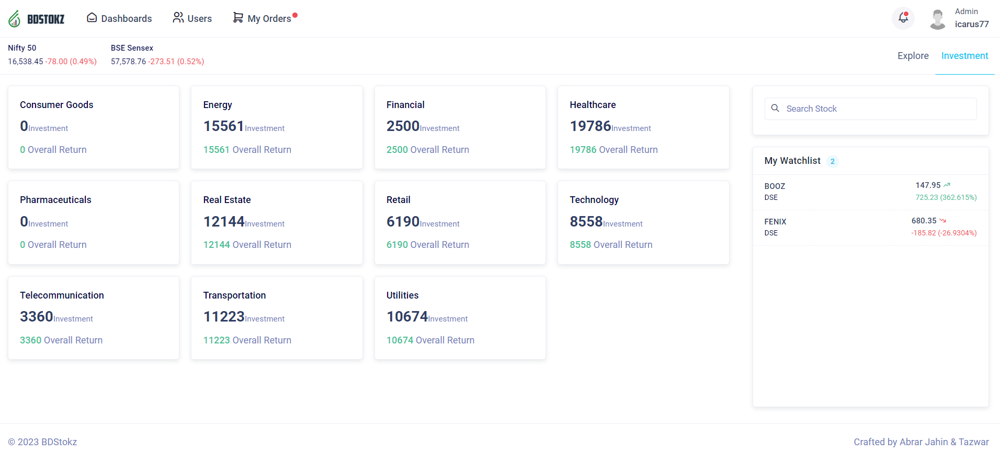
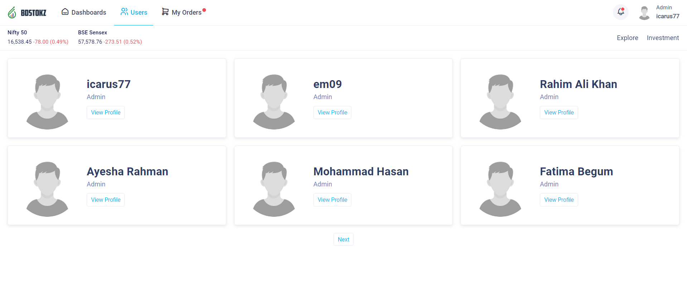

# BDStokz - Your Ultimate Stock Trading Platform

Welcome to BDStokz, a cutting-edge stock trading platform designed to provide an immersive and efficient trading experience. BDStokz is your one-stop solution for all your stock trading needs, offering a wide range of features to help you make informed decisions and maximize your investment potential.



## About BDStokz

BDStokz is a comprehensive stock trading website created as a college project. It allows users to buy and sell stocks, search for specific stock information, monitor the current market situation, and gain insights into the top gainers and losers. With a user-friendly interface and a plethora of tools at your disposal, BDStokz empowers both novice and experienced traders to thrive in the stock market.

## Key Features

- **Buy and Sell Stocks:** Execute stock trades seamlessly and efficiently, with real-time pricing and order execution.

- **Stock Search:** Find detailed information on any stock, including historical data, charts, and company fundamentals.

- **Market Situation:** Stay updated on the latest market trends and news, ensuring you never miss out on potential opportunities.

- **Top Gainers and Losers:** Identify which stocks are performing exceptionally well or struggling, helping you make informed investment decisions.

- **User-Friendly Interface:** Our intuitive interface ensures that users of all levels can navigate and utilize the platform with ease.
  


## Prerequisites


1. [Oracle 19c Database](https://www.oracle.com/database/)
2. [Node.js](https://nodejs.org)


## How to Get Started

### Get the Repository ###

Clone the repository using following commmand

```bash
git clone https://github.com/mrtaz77/BdStockz.git
```

 ### Initialize the Database ###

1. Connect to the system schema with system username and password using any database management tool

2. Run the following commands
```sql
CREATE USER c##BDStokz IDENTIFIED BY c##BDStokz;    
GRANT CONNECT, RESOURCE, DBA TO c##BDStokz;    
GRANT CREATE SESSION TO c##BDStokz;    
GRANT UNLIMITED TABLESPACE TO c##BDStokz;    
```
3. Reconnect to the newly created schema with the above credentials

4. Now go to the directory
   ```BDStokz/SQL Dump/Master Dump```
5. Run the query file ``` initDump.sql ```

### Dummy Data Generation (Optional) ###

1. Go to the directory ```BDStokz/SQL Dump/Master Dump```
2. Run the query file ``` dummyData.sql ```

### Explore the Platform ###


1. Install the dependencies by running the following command
   
   ```bash
    npm install
   ```

2. Run the backend server which is hosting the frontend by running

   ```bash
    node index.js
   ```

3. Open any browser and go to this link 
   ```
   http://localhost:3000/BdStokz_main/login/login.html
   ```

4. Sign up for a BDStokz account to access all our features or you can use the following dummy credentials
   
   ```JSON
   {
    "username": "em09",
    "password": "stockpulse09"
   }
   ```

5. Start trading


## UI Demonstration
1. Login page
   

2. User Dashboard
   

3. Notifications for a user
   

4. Order List
   

5. Succesful placement of order
   

6. Profit Montoring
   

7. Userlist
   

8. User Profile
   

  
  * You can also watch the following tutorial for detailed explanation 
  
    https://raw.githubusercontent.com/mrtaz77/BDStokz/someAssets/projectDemo.mp4


## Contact Us

Have questions or need assistance? We're here to help. Feel free to contact our support team at [jahinabrar5@gmail.com](mailto:jahinabrar5@gmail.com).

## Contributing

We welcome contributions from the open-source community. If you'd like to contribute to BDStokz, please read our [contribution guidelines](CONTRIBUTING.md) for more information.


## Disclaimer

BDStokz is a college project and not intended for actual stock trading. Use it for educational and experimental purposes only.
